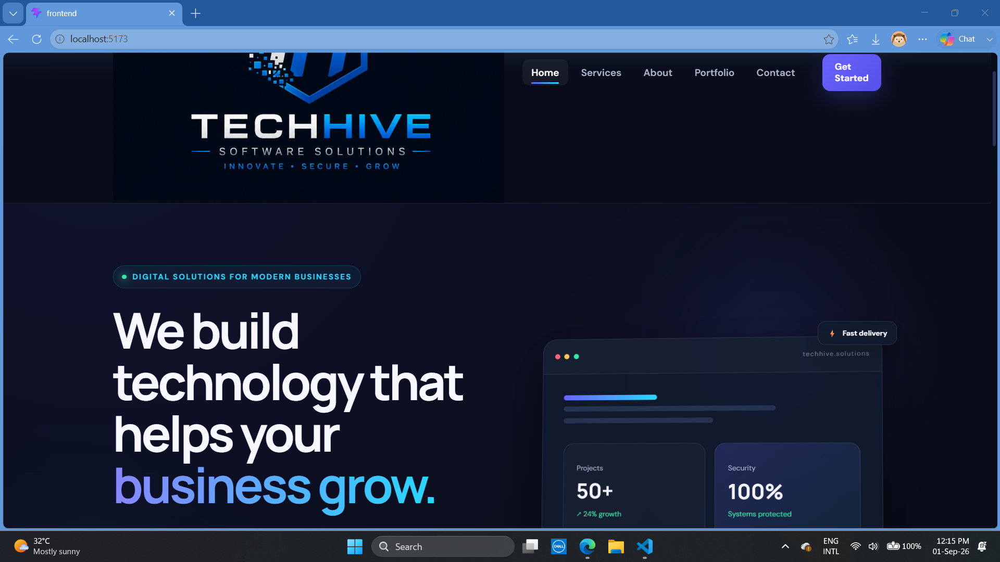
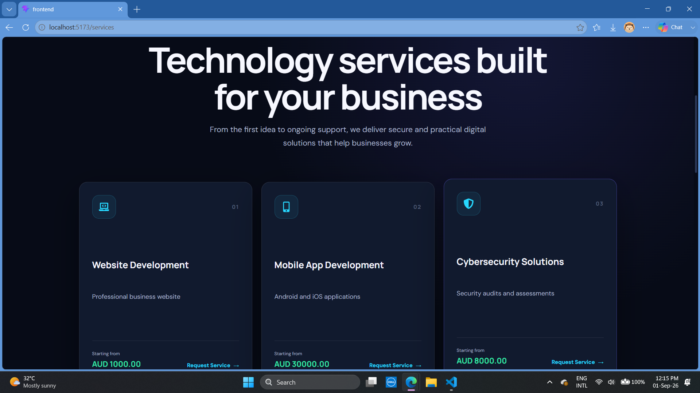
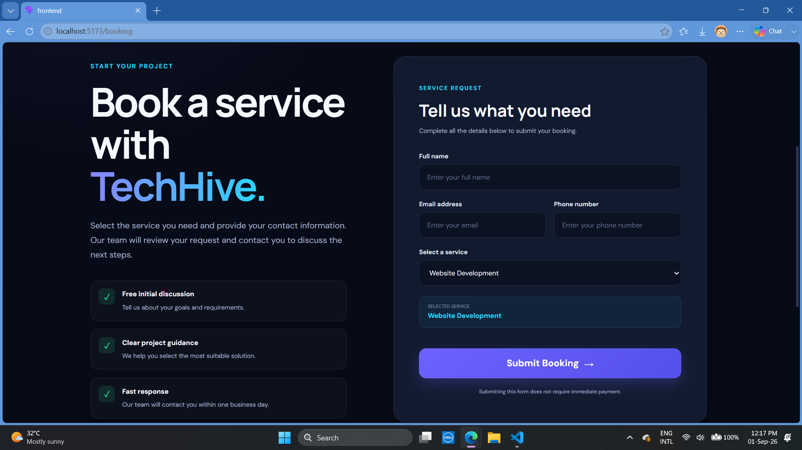
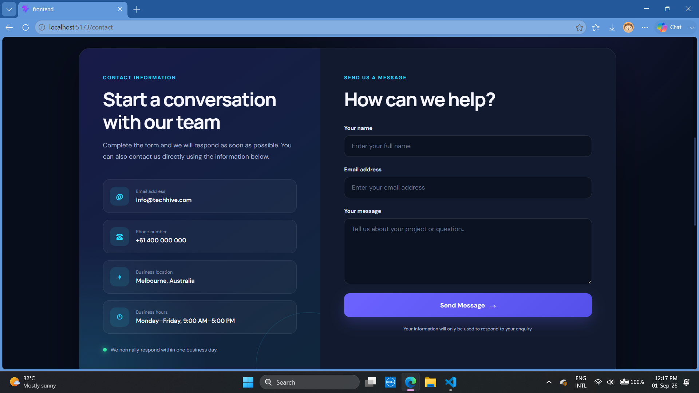
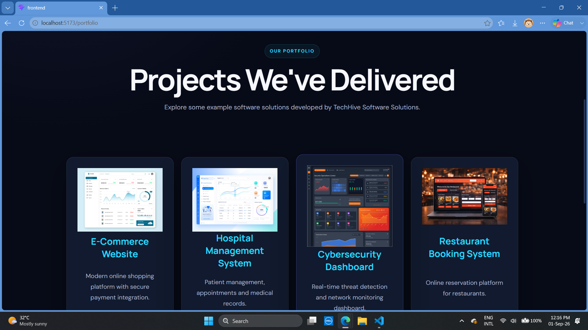
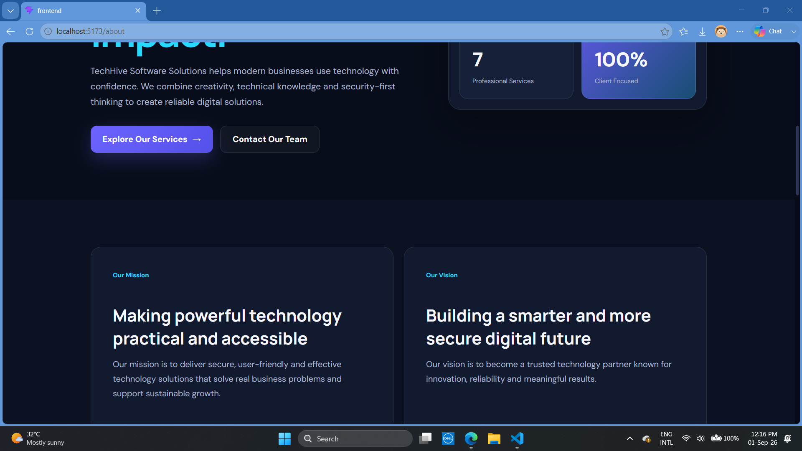

# TechHive Software Solutions

A full-stack technology services web application developed as a group project for the Small IT Business module.

## 📌 Project Overview

TechHive Software Solutions is a technology services platform that allows customers to explore available services, submit service booking requests, receive booking confirmations, and send enquiries.

The application also includes an administrative dashboard for managing customer bookings and enquiries.

## ✨ Features

- 🛠️ Technology services catalogue
- 📅 Customer service booking
- ✅ Booking confirmation
- 📩 Contact and enquiry system
- 🖥️ Administrative dashboard
- 📱 Responsive user interface
- 🔗 Frontend and backend integration
- 🗄️ MySQL database integration

## 🏗️ Application Architecture

Customer  
↓  
React Frontend  
↓  
Axios  
↓  
Express REST API  
↓  
MySQL Database

## 📸 Screenshots

### 🏠 Home Page

### 🛠️ Services Page

### 📅 Booking Page

### 📩 Contact Page

### 📁 Portfolio Page

### ℹ️ About Page

